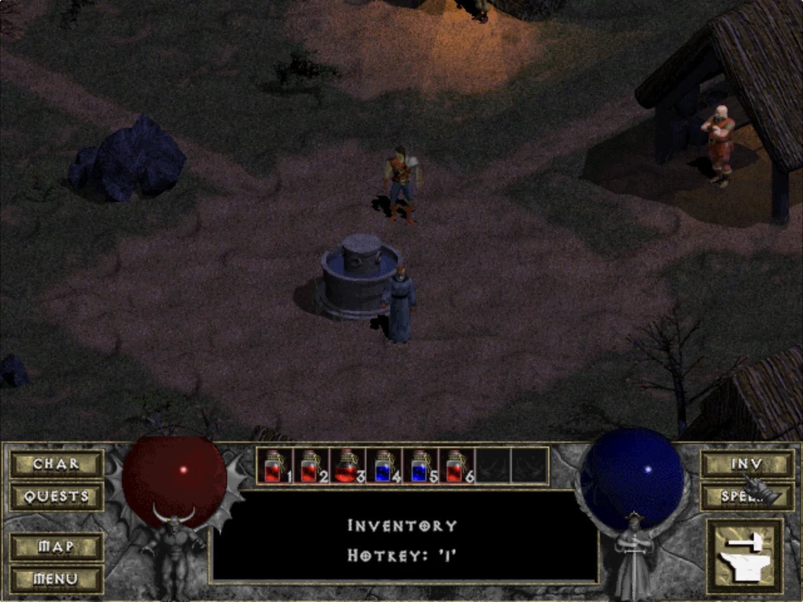
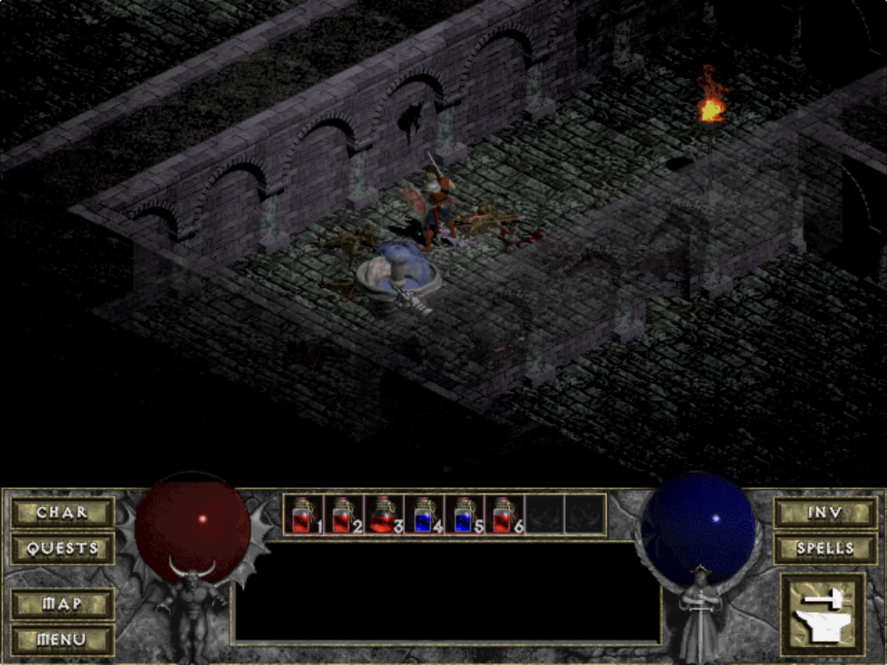
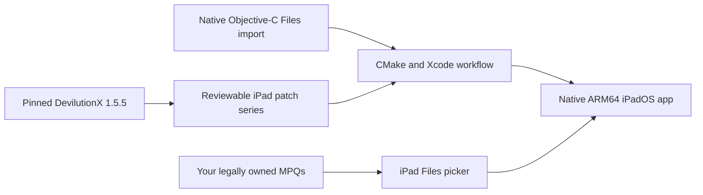

<p align="center">
  
</p>

<h1 align="center">DevilTouch</h1>

<p align="center"><strong>DevilutionX on iPad, rebuilt around direct touch.</strong></p>

<p align="center">
  A native ARM64 iPadOS experience for your legally owned Diablo and Hellfire game data.<br>
  Tap where you want to go. Tap what you want to fight. Keep the original game on screen.
</p>

<p align="center">
  <a href="#install-on-an-ipad"></a>
  <a href="#how-it-is-built"></a>
  <a href="https://github.com/diasurgical/DevilutionX"></a>
  <a href="#project-status"></a>
</p>

<p align="center">
  <a href="#install-on-an-ipad"><strong>Install on iPad</strong></a> ·
  <a href="#controls"><strong>Learn the controls</strong></a> ·
  <a href="#run-in-simulator"><strong>Run in Simulator</strong></a> ·
  <a href="doc/PLAYTEST.md"><strong>See the test record</strong></a>
</p>



> [!IMPORTANT]
> **DevilTouch is currently a source-only developer preview.** The native iPad build, signing, installation, first-run Files import, and real gameplay have been exercised on physical hardware. There is not yet a public IPA, TestFlight build, or App Store release. Building it today requires a Mac and Xcode.

## The original descent. A native iPad experience.

DevilTouch is a focused iPad integration for [DevilutionX](https://github.com/diasurgical/DevilutionX), the modern source port of the original Diablo engine. It is not an emulator, a streamed desktop session, or a repackaged copy of the game.

It keeps DevilutionX pinned and reviewable, adds a small iPad-specific patch series, and supplies the native import and build workflow needed to make the game feel at home on an iPad:

| | What it means |
|---|---|
| **Touch the world directly** | Tap a destination, monster, NPC, door, chest, or item. DevilTouch updates the target and uses Diablo's original action path. |
| **Keep the classic HUD** | Direct touch is the default. The virtual D-pad and action overlay are optional and off by default. |
| **Bring the hardware you like** | Screen touch, Magic Keyboard, trackpad, and mouse can be alternated without changing an input mode. |
| **Bring your own game** | DevilTouch never downloads or bundles Diablo data. A native Files picker imports MPQs from a copy you legally own. |
| **Run natively** | The device build is a thin Mach-O ARM64 iPadOS app produced with CMake and Xcode—not an emulated desktop binary. |
| **Stay close to upstream** | DevilutionX 1.5.5 is pinned as a submodule. iPad changes remain in a small, reproducible patch layer. |

## See it in action



<p align="center"><sub><strong>From Tristram to the Cathedral.</strong> Movement, targeting, combat, drops, doors, death, and save loading have been exercised with touch.</sub></p>

<p align="center"><sub>Screenshots show the current iPad build using legally owned game data. Game data is not included in this repository.</sub></p>

## Install on an iPad

### What you need

- A Mac with a current Xcode installation
- CMake 3.21 or newer and Git
- An Apple ID configured for development signing in Xcode
- A paired iPad with Developer Mode enabled
- `DIABDAT.MPQ` from a legally obtained copy of Diablo; Hellfire files are optional

The current build was verified with an Apple silicon Mac, Xcode 26.6, an iPad Pro 12.9-inch (6th generation), and iPadOS 26.5.2. The generated app targets iPadOS 13.0 or newer, but that is not yet a claim of complete testing across every compatible iPad.

### 1. Clone everything

```sh
git clone --recurse-submodules https://github.com/chrissotraidis/deviltouch.git
cd deviltouch
```

If you already cloned without submodules:

```sh
git submodule update --init --recursive
```

### 2. Prepare the iPad

1. Open **Xcode → Settings → Accounts** and sign in with your Apple ID.
2. Connect and trust the iPad, then enable **Settings → Privacy & Security → Developer Mode** on the device.
3. Keep the iPad connected, unlocked, and visible to Xcode.

### 3. Build, sign, install, and launch

Use the 10-character team identifier associated with your Apple Development signing identity:

```sh
DEVELOPMENT_TEAM=YOURTEAMID ./scripts/run-ios-device.sh
```

The script configures the pinned engine, applies the checked-in patch series, builds a Release ARM64 app, asks Xcode to provision it, verifies the signature, finds the paired iPad, installs the app, and launches it.

If more than one iPad is connected, select one explicitly:

```sh
DEVELOPMENT_TEAM=YOURTEAMID \
DEVICE_ID=YOUR-COREDEVICE-IDENTIFIER \
./scripts/run-ios-device.sh
```

> [!NOTE]
> A free Apple Personal Team can sign apps for your own devices, but Apple applies a short provisioning lifetime and a three-development-app device limit. A paid Apple Developer Program membership removes those free-team restrictions; neither option makes DevilTouch an App Store build.

### 4. Import your game on first launch

When no base game archive is present, DevilTouch opens the native iPad Files picker automatically. Select one base archive:

- `DIABDAT.MPQ` — the full original game
- `spawn.mpq` — the shareware data archive

For Hellfire, select any files you own alongside the base archive:

- `hellfire.mpq`
- `hfmonk.mpq`
- `hfmusic.mpq`
- `hfvoice.mpq`

Multiple files may be selected together. DevilTouch validates recognized filenames and MPQ headers, copies canonical lowercase files into its Files-visible Documents folder, and then lets DevilutionX perform its normal content validation. The app never copies executables, movies, manuals, or unrelated installation files.

In-place development updates preserve the app's Documents container. Back up saves and game data through Files before deleting the app; iPadOS removes the app container when the app itself is deleted.

<details>
<summary><strong>Where do I find the MPQ files?</strong></summary>

Locate the installed game directory from a copy you legally own. Steam, GOG, and original-media installations may arrange their folders differently, but the required filenames above are the same. Do not commit them to this repository: `ref/`, build output, and proprietary archive formats are deliberately excluded from Git.

</details>

## Run in Simulator

Simulator is the fastest way to inspect the build and contribute to the project. It does not replace physical touch, signing, performance, or lifecycle testing.

```sh
git clone --recurse-submodules https://github.com/chrissotraidis/deviltouch.git
cd deviltouch
./scripts/run-ios-simulator.sh /path/to/your/Diablo
```

If you keep a local Steam export in this repository's ignored `ref/Diablo` directory:

```sh
./scripts/run-ios-simulator.sh ref/Diablo
```

The runner builds the app, boots or reuses an iPad Simulator, installs recognized MPQs into that app's Documents container, and launches in landscape. If Simulator remains portrait, rotate it once from the Simulator toolbar.

For real pointer and keyboard testing in Simulator:

- Enable **I/O → Input → Send Pointer to Device** for native mouse/trackpad buttons and wheel events.
- Enable **I/O → Keyboard → Connect Hardware Keyboard** for keyboard shortcuts and text entry.

Without pointer forwarding, Simulator converts every host click—including a host right-click—into a one-finger screen tap. That is a Simulator limitation, not a valid secondary-click test.

## Controls

DevilTouch adds no permanent action bar. The screen itself is the primary controller.

| Input | Action |
|---|---|
| **Tap the world** | Walk to a destination or act on the tapped monster, NPC, object, door, chest, or visible item. |
| **Press and hold** | Retain Diablo's original held-left-click behavior for continuous walking, repeated attacks, and other held actions. |
| **Drag across the world** | Continuously update the active target under your finger. |
| **Tap a ground item** | Highlight it, walk to it, and pick it up as one complete action. |
| **Tap an inventory item** | Lift it; tap the destination slot to place or equip it. |
| **Two-finger tap an item** | Perform its native context action: use a potion or scroll, or transfer an item when Gillian's stash is open. |
| **Tap a menu row** | First tap moves the red selector. Tap the selected row again to confirm. |
| **Swipe a merchant list** | Move through buy, sell, repair, recharge, and identify lists without activating the row where the swipe began. |
| **Mouse/trackpad primary click** | Diablo's original left-click action. |
| **Mouse/trackpad secondary click** | Diablo's original right-click action: use the targeted item or cast the selected spell. |
| **Hardware keyboard** | Stock DevilutionX shortcuts, navigation, modifiers, and text entry. |

Text and number prompts—including hero names, chat, gold splitting, and stash withdrawal—request iPadOS text input when opened. iPadOS uses an attached hardware keyboard when available and presents its software keyboard when one is not serving the field.

Prefer a traditional overlay? Enable **Settings → Controller → Touch Controls**. The optional D-pad and action buttons stay above the original HUD and hide when native side panels need the space. Duplicate potion and menu controls have been removed; Diablo's original belt and panel buttons remain directly touchable.

## How it is built

DevilTouch is intentionally a thin integration layer. The renderer, game rules, pathfinding, saves, and content support remain DevilutionX. DevilTouch owns the iPad-specific edges: direct input, native import, app identity, signing workflow, and current-Apple-toolchain compatibility.



The upstream source is pinned at DevilutionX commit `7223eeac9e8274fbf665b4de86fda26d3b22c52f` (release 1.5.5). Keeping the integration as an overlay makes every modification inspectable and makes future upstream updates a deliberate patch-rebase rather than an opaque source fork.

| Path | Purpose |
|---|---|
| [`upstream/DevilutionX`](upstream/DevilutionX) | Pinned official upstream source submodule |
| [`patches/ios`](patches/ios) | Direct touch, item targeting, native import hooks, app identity, and device configuration |
| [`patches/dependencies`](patches/dependencies) | Narrow Xcode 26 compatibility fixes for pinned dependencies |
| [`platform/ios`](platform/ios) | Native document picker, copy progress, validation bridge, and app icon |
| [`scripts`](scripts) | Reproducible configure, build, import, install, launch, and asset-safety commands |
| [`doc/PLAYTEST.md`](doc/PLAYTEST.md) | Evidence ledger for verified behavior and remaining physical-device gates |
| [`doc/PRD.md`](doc/PRD.md) | Product goals, constraints, acceptance loop, and roadmap |
| [`FEASIBILITY.md`](FEASIBILITY.md) | Original technical, legal, and distribution feasibility study |

### Developer commands

```sh
# Configure or build
./scripts/configure-ios-simulator.sh
./scripts/build-ios-simulator.sh
./scripts/configure-ios-device.sh
./scripts/build-ios-device.sh

# Import owned data into a booted Simulator
./scripts/import-game-data.sh /path/to/your/Diablo

# Verify no proprietary archives are tracked
./scripts/check-no-proprietary-assets.sh
```

Generated apps are written to:

```text
build/ios-simulator/Release-iphonesimulator/devilutionx.app
build/ios-device/Release-iphoneos/devilutionx.app
```

The device builder produces an unsigned ARM64 app when `DEVELOPMENT_TEAM` is omitted, which is useful for compile verification. Supplying a team enables Xcode-managed signing and an installable development build.

## Project status

### Verified in the current checkpoint

- Native ARM64 Simulator and physical-iPad compilation
- Xcode-managed development signing, strict signature verification, installation, and launch
- In-place update with the same Documents container and retained configuration/game data
- First-launch native Files import with filename, MPQ-header, and engine content validation
- Diablo and Hellfire detection, hero creation, Tristram, Cathedral entry, combat, death, save loading, and item pickup
- Direct touch as the default with the unobstructed original HUD
- Menu select-then-confirm behavior across representative front-end, settings, pause, NPC, shop, and death screens
- Simulator keyboard text entry and core hardware-keyboard shortcuts
- A no-proprietary-assets guard for tracked repository content

### Still being validated before a public binary release

- Complete physical-iPad touch, Magic Keyboard, trackpad, and mouse matrix across the full game
- All store variants, confirmation dialogs, targeted spells, and inventory/stash edge cases
- Long-session stability, suspend/resume, thermal behavior, audio, and 120 Hz verification
- Software-keyboard behavior for every text and numeric field on physical hardware
- Modern iPadOS scene lifecycle and windowing behavior
- Distribution packaging; there is currently no public IPA, TestFlight build, AltStore source, or App Store listing
- Multiplayer, which is disabled while the single-player input experience is stabilized

The complete, continuously updated evidence and retest list lives in [`doc/PLAYTEST.md`](doc/PLAYTEST.md). Planned release goals and non-goals live in [`doc/PRD.md`](doc/PRD.md).

## Troubleshooting

<details>
<summary><strong>The build says CMake or Xcode command-line tools are missing</strong></summary>

Confirm both tools are available:

```sh
xcode-select -p
cmake --version
```

Launch Xcode once to complete its first-run setup. Install CMake from [cmake.org](https://cmake.org/download/) or with your preferred package manager.

</details>

<details>
<summary><strong>No paired iPad was found</strong></summary>

Connect the iPad, unlock it, accept the trust prompt, enable Developer Mode, and confirm it appears under **Xcode → Window → Devices and Simulators**. If several iPads are connected, pass the intended CoreDevice identifier through `DEVICE_ID`.

</details>

<details>
<summary><strong>Signing or provisioning failed</strong></summary>

Verify that Xcode is signed into the intended Apple ID and that `DEVELOPMENT_TEAM` is the matching 10-character team ID. Free Personal Teams are limited to three active development apps per device; remove an unneeded development app if that limit has been reached.

</details>

<details>
<summary><strong>The game asks for data or will not pass the splash screen</strong></summary>

Import `DIABDAT.MPQ` or `spawn.mpq` through the first-run picker. A renamed unrelated file will fail validation. Hellfire archives are optional and do not replace the required base archive.

</details>

<details>
<summary><strong>Right-click acts like a normal tap in Simulator</strong></summary>

Enable **I/O → Input → Send Pointer to Device**. Without it, Simulator synthesizes touch input and does not deliver a real secondary mouse button to the app.

</details>

<details>
<summary><strong>A red or gold silhouette appears above the INV panel</strong></summary>

That is Diablo's original low-durability warning, not a DevilTouch overlay. It appears when equipped gear has five durability or less and disappears after the item is repaired or replaced.

</details>

<details>
<summary><strong>I deleted the app and my data disappeared</strong></summary>

Installing a new development build over the existing app preserves its container. Deleting the app removes its sandbox, including Documents. Use Files to back up your MPQs, saves, and configuration before deletion.

</details>

## Contributing

Issues and focused pull requests are welcome, especially when they include:

1. The exact iPad model, iPadOS version, and attached input hardware
2. A short reproduction path and the expected original Diablo behavior
3. Whether the issue occurs with direct touch, pointer, keyboard, or the optional overlay
4. A regression check against nearby controls or menus

Keep changes small and upstream-friendly. General engine bugs belong with [DevilutionX](https://github.com/diasurgical/DevilutionX); iPad integration, import, signing, and DevilTouch-specific input behavior belong here. Never attach or commit proprietary game archives.

Before opening a change:

```sh
./scripts/check-no-proprietary-assets.sh
git diff --check
```

## License, game data, and attribution

DevilTouch is free of charge and non-commercial. The code and patches are governed by the [Sustainable Use License](LICENSE.md), including its non-commercial distribution limits. Modified distributions must preserve the license, upstream notices, and the prominent modification notice in [`NOTICE.md`](NOTICE.md).

DevilTouch and DevilutionX do **not** ship Diablo or Hellfire game data. You must supply files from a legally obtained copy. Do not upload MPQs to issues, pull requests, build artifacts, mirrors, or release bundles.

DevilTouch is an unofficial modified distribution workflow built on [DevilutionX](https://github.com/diasurgical/DevilutionX). It is not affiliated with or endorsed by the DevilutionX maintainers, Blizzard Entertainment, GOG.com, or Valve. Diablo and Hellfire are trademarks of Blizzard Entertainment.

## Acknowledgements

- The [DevilutionX contributors](https://github.com/diasurgical/DevilutionX/graphs/contributors), who made a modern, portable engine possible
- The original Devilution reverse-engineering community
- The SDL, CMake, and Apple-platform projects that make a native iPad build possible
- The players testing every awkward menu, potion, inventory slot, shop list, keyboard prompt, and dungeon interaction

<p align="center">
  <strong>Bring your game. Bring your iPad. Descend.</strong>
</p>
